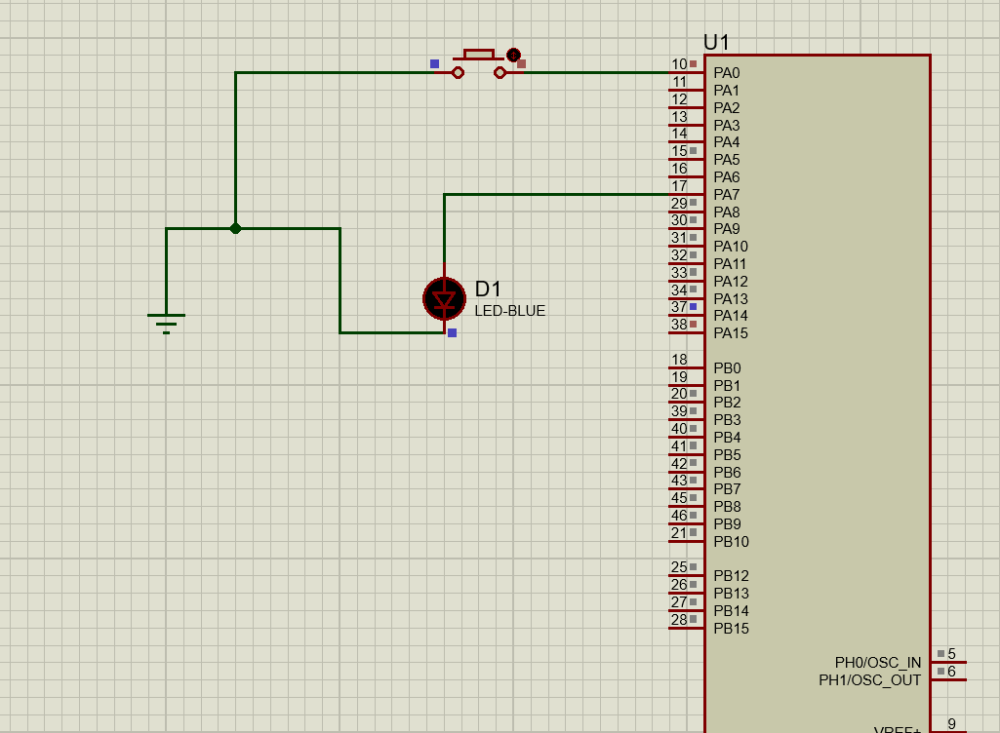

## stm32f401

<h1 style="text-align: center;"> Computer Vision Course Tasks</h1>

In this Repository i present a variety of embedded tasks implemented using `C`.

## labs

# lab 7 :
A software to perform an LED toggle based on a button press. The Software shall detect a falling edge event on the button pin and then toggle the LED in an ISR.

