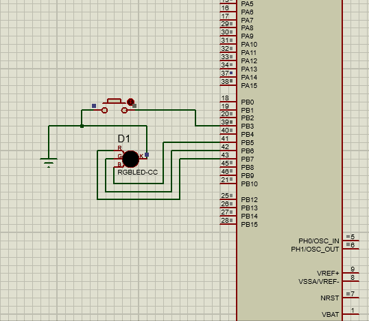

<h1 style="text-align: center;"> stm32f401 task</h1>

In this Repository i present a variety of embedded tasks implemented using `C`.

## labs

# lab 3:

simple toggling led 

# lab 4:
You are required to build a software that display a decimal counter value on a seven segment display.
The expected output is as follow:
1-GPIO.c file that include the implementation of the GPIO driver functions.
2-GPIO.h file that include the declaration of the GPIO driver functions.
3-Main.c file that use the GPIO functions to display a counter value on a seven segment display.
The following requirements shall be followed during implementation.
GPIO driver shall provide a function called GPIO_Init.
-The function shall take the following arguments, port name, pin number, pin direction and default state.
-The function shall initialize the GPIO registers as per the values passed through the arguments.
-The function shall not have a return.
GPIO driver shall provide a function called GPIO_WritePin.
-The function shall have the following arguments, port name, pin number and data to be written (0 or 1).
-The function shall check the initialized configuration of the requested pin argument. If it didn’t match the write request needs, it shall return NOK and didn’t perform the action.
-If the pin initialization matches the needs of the write request, it shall return OK and perform the requested actions.

# lab 5:
You are required to build a software that display a number on a seven-segment display after pressing a button on a keypad. The implemented GPIO driver shall be used to interface the Keypad and the seven-segment display.
The expected output is as follow:
1-Keypad.h that contains the declarations for the keypad manager APIs.
2-Keypad.c that contains the implementations for the keypad driver APIs.
3-Main.c that contains the implementation of the required application.
The following requirements shall be followed during implementation.
-The implemented GPIO driver shall be used by the Keypad driver APIs.
-Keypdad_init
Function shall not take any arguments. It will be used to initialize the internal keypad driver variable(s).
-Keypad_manage
Function shall not take any arguments.
Function shall be called periodically from the infinite loop in main function.
Function shall scan all keys to check which one is pressed.
Once a valid key press detected, function shall do the following:
Store the pressed key value.
Call a function “KeypadCallouts_KeyPressNotificaton” and shall not pass any arguments to it.
Only a transition from no key pressed to one key press shall be considered as a valid press.
After the key press, the value of the stored key shall not be changed until the key is released.
The value of the stored key shall  not be changed until key is released and Keypad_GetKey function is called.
Function shall use lookup table implementation to define the value of the pressed key.
-Keypad_GetKey
Function shall be called by application to get the last stored key.

# lab 6:
You are required to define a group of symbolic macros to define all the registers offsets in one GPIO channel.
You are required to define a generic macro for the GPIO registers definition instead of using the library provided by STM.
The Generic macro shall be on the form GPIO_REG(PORT_ID, REG_ID)
You are required to rewrite the GPIO driver using the newly defined macro. You will use the register offset macros to be passed to REG_ID argument. No use of switch case for port selection.

# lab 7 :
A software to perform an LED toggle based on a button press. The Software shall detect a falling edge event on the button pin and then toggle the LED in an ISR.

# task 2:
RGB LED controller.
The system is consisted of 1 push button and 1 RGB LED. The Push button is connected to PORTB pin 3. The 3 LED pins are connected to port B pins 5, 6 and 7. The Push button is active low, without external pull up resistor.
You are required to write a code that scans the button periodically. At each valid button press, the Software shall change the RGB LED color.
A button press shall be considered valid only when a falling edge is detected on the button pin. Button debouncing feature shall be added. The LED shall provide 8 colors controlled by the enabled colors mix (RED + GREEN + BELOW).

# task 3:
Add a GPIO_ReadPin function to the GPIO driver. Use the complete driver to perform the same actions of HW Task 2.

# task 4:
A software to perform a decimal counter on a 7-segment display. System inputs shall be two push buttons. System output shall be 1 seven segment display. Two interrupts to be configured on GPIO falling edge, one for each button. The first ISR shall increment the counter. The second ISR shall decrement the counter. The main function shall perform the display actions. Race condition shall be taken into consideration to protect the counters from being corrupted.

